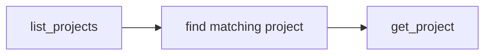

# Using Stitch MCP to Find & Implement Designs

## Overview

Stitch is a Google design tool that publishes UI designs via an MCP (Model Context Protocol) server. An AI coding agent can query Stitch to:

- List and inspect design projects
- View individual screens and their visual structure
- Extract design systems (colors, typography, spacing, components)
- Generate new screens or variants from text prompts
- Apply a design system directly into code

This doc describes the workflow an AI agent should follow when asked to implement a Flutter UI based on a Stitch design.

---

## 1. Connected MCP Server

The Stitch server is configured in `cline_mcp_settings.json` as a `streamableHttp` server at `https://stitch.googleapis.com/mcp` with an API key.

**Server name:** `stitch` (NOT `github.com/stitch-tools/stitch-mcp`)

**Config location:** `~/.config/Code/User/globalStorage/saoudrizwan.claude-dev/settings/cline_mcp_settings.json`

### 🌟 CRITICAL: Correct Parameter Formats

Google Stitch APIs use **resource name-based addressing** (like most Google APIs). This is the #1 source of AI agent mistakes.

| Tool | ❌ Wrong | ✅ Correct |
|------|----------|------------|
| `get_project` | `{projectId: "abc123"}` | `{name: "projects/abc123"}` |
| `list_screens` | `{projectId: "abc123"}` | `{parent: "projects/abc123"}` |
| `get_screen` | `{screenId: "xyz789"}` | `{name: "projects/abc123/screens/xyz789"}` |
| `create_design_system` | `{projectId: "abc123", name: "DS"}` | `{projectId: "abc123", designSystem: {displayName: "DS", theme: {...}}}` |
| `create_design_system_from_design_md` | `{projectId: "abc123", designMd: "..."}` | `{projectId: "abc123", selectedScreenInstance}` |
| `update_design_system` | `{designSystemId: "ds001"}` | `{name: "projects/abc123/designSystems/ds001", projectId: "abc123", designSystem: {...}}` |
| `apply_design_system` | `{projectId: "abc123", designSystemId: "ds001"}` | `{projectId: "abc123", selectedScreenInstances: [...]}` |
| `upload_design_md` | `{projectId: "abc123", designMd: "..."}` | `{projectId: "abc123", designMdBase64: "<base64>"}` |

**Non-existent tools (do NOT call):**
- `get_screen_html` — does not exist
- `get_screen_data` — does not exist
- `get_design_system` — does not exist

### Auto-Approval Caveat

Only these tools are auto-approved in the MCP config:
- `list_projects` / `stitch_listProjects`
- `stitch_getProject`
- `listTools` / `list_tools`
- `get_screen_html` (non-existent — will error)
- `get_screen_data` (non-existent — will error)

All other tools (including `get_screen`, `list_screens`, `create_design_system`, etc.) require **explicit user approval** before execution. Do not try to work around this — wait for approval.

### Tool Reference

#### Project Tools

| Tool | Required Parameters | Output |
|------|--------------------|--------|
| `list_projects` | `{}` (none) | Array of `{name, displayName, updatedAt}` |
| `get_project` | `{name: "projects/{project}"}` | Project with screens and design-system refs |
| `create_project` | `{title, description?}` | New project |

#### Screen Tools

| Tool | Required Parameters | Output |
|------|--------------------|--------|
| `list_screens` | `{parent: "projects/{project}"}` | Array of `{name, displayName, thumbnailUrl?}` |
| `get_screen` | `{name: "projects/{project}/screens/{screen}"}` | Full screen layout tree, styles, text, images |
| `generate_screen_from_text` | `{projectId, prompt}` | AI-generated screen (takes 30–60s — do NOT retry) |
| `edit_screens` | `{projectId, selectedScreenIds: [...], prompt}` | Bulk edit across screens |
| `generate_variants` | `{projectId, selectedScreenIds: [...], variantOptions: {variantCount, creativeRange, aspects}}` | Screen variants |

#### Design System Tools

| Tool | Required Parameters | Output |
|------|--------------------|--------|
| `list_design_systems` | `{projectId?}` | Array of design systems with `name`, `displayName`, `theme` |
| `create_design_system` | `{projectId, designSystem: {displayName, theme: {...}}}` | New design system |
| `create_design_system_from_design_md` | `{projectId, selectedScreenInstance}` | Design system from a screen's data |
| `update_design_system` | `{name, projectId, designSystem: {...}}` | Update existing |
| `apply_design_system` | `{projectId, selectedScreenInstances: [...], assetId?}` | Apply to selected screens |
| `upload_design_md` | `{projectId, designMdBase64: "<base64>"}` | Upload base64-encoded design spec |

---

## 2. Recommended Workflow

When told "implement this design from Stitch", follow these steps in order.

### Step A: Discover the Project



1. Call `list_projects` to see all available projects.
2. Match the user's description against project `displayName`.
3. Call `get_project({name: "projects/{project}"})` to get the project's screen list and metadata.

**Correct:** `get_project({name: "projects/abc123"})`
**Wrong:** `get_project({projectId: "abc123"})`

### Step B: Inspect Screens

```
list_screens({parent: "projects/{project}"})    → all screens in project
get_screen({name: "projects/{project}/screens/{screen}"})  → full layout with styling
```

**Which one to call?**
- `list_screens` gives you the list of screens with their resource names.
- `get_screen` gives the richest output — layout tree, text styles, fill colors, spacing.

Call at least `get_screen` on the primary screen(s) you need to implement.

**DO NOT call** `get_screen_html` or `get_screen_data` — these tools do not exist on this server.

### Step C: Extract the Design System

```
list_design_systems({projectId})   → see if a design system exists
```

If a design system exists for the project, the `list_design_systems` response will include `theme` data containing:

- **Colors** – fill, text, surface, border tokens with hex values
- **Typography** – font family, size, weight, line height per text style
- **Spacing** – padding, gap, margin tokens
- **Corner radius / elevation** – shape tokens
- **Component definitions** – reusable patterns

**DO NOT call** `get_design_system({designSystemId})` — this tool does not exist. The design system details are in the `list_design_systems` response.

If no design system exists, you can create one:

```
create_design_system_from_design_md(
  projectId: "abc123",
  selectedScreenInstance: "the screen data from get_screen"
)
```

or:

```
create_design_system(
  projectId: "abc123",
  designSystem: {
    displayName: "Zen Design System",
    theme: {
      colors: { paperBg: "#F8F6F0", ink: "#2D2A24", ... },
      typography: {
        headline: { font: "Source Serif 4", size: 24, weight: 600 },
        body: { font: "Inter", size: 14, weight: 400, lineHeight: 20 },
        label: { font: "Inter", size: 11, weight: 500, lineHeight: 14 }
      }
    }
  }
)
```

### Step D: Generate Code

Translate the design tokens and screen layout into Flutter code.

**Typical mapping:**

| Stitch Token | Flutter |
|---|---|
| colors → fills, text | `app_theme.dart` – `Color` constants |
| typography | `GoogleFonts.xyz()` or `TextStyle` |
| spacing / padding | `EdgeInsets`, `SizedBox`, `gap` |
| corner radius | `BorderRadius.circular()` |
| elevation | `BoxShadow` |
| layout tree | `Row`, `Column`, `Stack`, `ListView` |

---

## 3. Example: Extracting a "Zen Assistant" Chat Screen

Below is a real-world example showing how Stitch → Flutter translation works.

### 3.1 Discover

```
list_projects → find "jarvis_flutter" or "Zen Assistant" project
get_project({name: "projects/project_xyz"})
```

Result: project contains a single screen "Chat Screen".

### 3.2 Inspect Screen

```
get_screen({name: "projects/project_xyz/screens/screen_abc"})
```

From the output, extract:

```
colors:
  #F8F6F0   → paperBg (background)
  #FFFFFF   → paperSheet (cards, input)
  #2D2A24   → ink (text, icons)
  #E8E4DA   → surfaceVariant (borders)
  #EAE6DD   → surfaceContainer (input bg)
  #D4CFC4   → outline (date marker, hints)
  #A8A294   → onSurfaceVariant (secondary text)
  #E6DFCC   → secondaryContainer (chip bg)
  #3E3A33   → onSecondaryContainer (chip text)
  #C4BBA8   → surfaceContainerHighest (border)

typography:
  Headline "Zen Assistant":
    font: Source Serif 4, 24px, w600, -1% letter-spacing
  Body text:
    font: Inter, 14px, w400, 20px line height
  Small labels (date, chip, AI header):
    font: Inter, 11px, w500, 14px line height, 2% letter-spacing

spacing:
  horizontal padding: 24px
  message gap: 32px below date marker
  chip gap: 8px
  input vertical: 32px bottom safe area
  chip padding: 16px horizontal, 8px vertical
```

### 3.3 Create Design System (optional)

```
create_design_system(
  projectId: "project_xyz",
  designSystem: {
    displayName: "Zen Design System",
    theme: {
      colors: { paperBg: "#F8F6F0", ink: "#2D2A24", ... },
      typography: {
        headline: { font: "Source Serif 4", size: 24, weight: 600 },
        body: { font: "Inter", size: 14, weight: 400, lineHeight: 20 },
        label: { font: "Inter", size: 11, weight: 500, lineHeight: 14, letterSpacing: 0.02 }
      }
    }
  }
)
```

### 3.4 Implement in Flutter

Create files in this order:

1. **`lib/app_theme.dart`** – color constants, text style helpers
2. **`lib/models/chat_message.dart`** – data model
3. **`lib/widgets/message_bubble.dart`** – message bubble with text + timestamp
4. **`lib/widgets/typing_indicator.dart`** – animated dots
5. **`lib/screens/chat_screen.dart`** – full screen layout
6. **`lib/main.dart`** – entry point

**Layout structure (from Stitch screen):**

```
Scaffold
 ├─ AppBar (toolbarHeight: 64)
 │    ├─ menu button (left, 40×40)
 │    ├─ "Zen Assistant" title (center)
 │    └─ history button (right, 40×40)
 ├─ Center (maxWidth: 720)
 │    └─ Column
 │         ├─ Expanded ListView
 │         │    ├─ DateMarker "TODAY"
 │         │    ├─ MessageBubble (AI greeting)
 │         │    ├─ MessageBubble (user messages)
 │         │    └─ TypingIndicator (when AI is replying)
 │         └─ Bottom Input
 │              ├─ QuickChips row (horizontal scroll)
 │              └─ Input container (24px rounded)
 │                   ├─ Add (+) button
 │                   ├─ TextField (multi-line)
 │                   └─ Send (↑) button
```

---

## 4. Common Pitfalls & Tips

### 4.1 Parameter names are THE most common AI mistake

Google Stitch uses Google-style resource naming. The pattern is always `"projects/{project}/screens/{screen}"` or `"projects/{project}/designSystems/{ds}"`. You must pass these as `name` parameters, never as `projectId` or `screenId`.

### 4.2 Don't call tools that don't exist

`get_screen_html`, `get_screen_data`, and `get_design_system` do NOT exist. You will get a tool error if you try. Always refer to the tool table above.

### 4.3 Don't guess colors
Always extract exact hex values from `get_screen` or `list_design_systems`. Stitch uses a specific palette — eyeballing leads to drift.

### 4.4 Typography matters
Stitch specifies line-height (`height` in Flutter is `lineHeight / fontSize`). Pass the ratio, not a pixel value. Example: lineHeight 20 ÷ fontSize 14 = `height: 1.428`.

### 4.5 Use Google Fonts
If the Stitch design uses Source Serif 4 or Inter (common), add `google_fonts` to `pubspec.yaml` and use `GoogleFonts.sourceSerif4()` / `GoogleFonts.inter()`.

### 4.6 Layout boundaries
If a screen has `max-width` or centering constraints, capture them. Stitch often designs at a fixed width (e.g. 390px mobile). The Flutter implementation should center the content with `ConstrainedBox(maxWidth: 720)` on larger screens.

### 4.7 Quick chip colors
Secondary container and on-secondary-container colors are frequently used for pill/chip components. Extract the exact token.

### 4.8 Shadows & borders
Stitch often uses subtle borders (`0.5px`, `1px`) and very light box shadows (`0, 2px, 4px, 2% opacity`). Match these precisely for a polished look.

### 4.9 Safe areas
Always wrap the bottom input area in `SafeArea` to handle device notches and home indicators.

### 4.10 Timeouts on generation tools
`generate_screen_from_text` can take 30–60 seconds. If the call times out, do NOT retry immediately — the generation may still be in progress and will complete asynchronously.

---

## 5. Quick Reference Card

```
1. list_projects                                          → find project
2. get_project({name: "projects/{project}"})              → get screen list
3. list_screens({parent: "projects/{project}"})           → find target screen
4. get_screen({name: "projects/{project}/screens/{screen}"})  → extract layout + styles
5. list_design_systems({projectId})                       → find existing design system
6. Implement Flutter code in order:
   a. app_theme.dart (colors + typography)
   b. models (data classes)
   c. widgets (reusable components)
   d. screens (page layout)
   e. main.dart (entry point)
```

**Remember:**
- Server name is `stitch`, NOT `github.com/stitch-tools/stitch-mcp`
- Use resource names (`"projects/{project}/screens/{screen}"`) not short IDs
- `get_screen_html`, `get_screen_data`, `get_design_system` — do NOT exist
- `get_project` takes `name`, not `projectId`
- `list_screens` takes `parent`, not `projectId`
- `create_design_system` takes nested `designSystem` object
- `upload_design_md` takes `designMdBase64` (base64-encoded)
- `generate_screen_from_text` takes 30–60s — do not retry on timeout

---

*Last updated: June 2026 – Stitch MCP v1 (Google Stitch)*